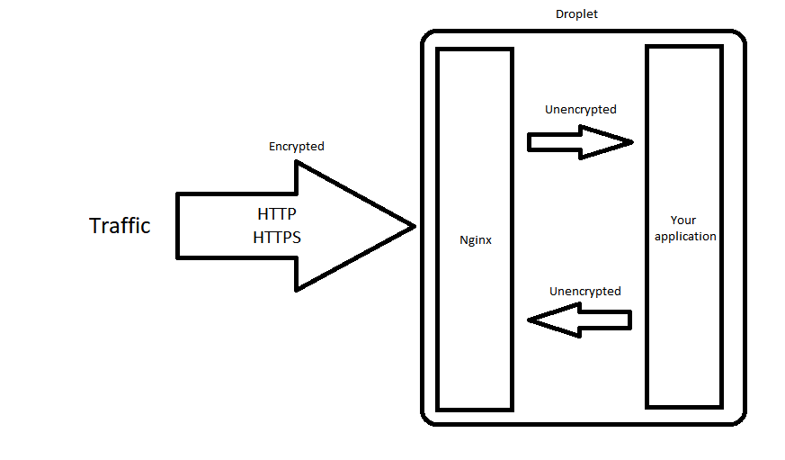

# digitalocean-spring-droplet-template

As the name more or less implies, this repository is a template of the necessary 
dependencies required to run a spring boot application on a fresh droplet.

Rather than having your Spring application take care of the certificates, this uses Nginx as reverse proxy
to perform SSL termination. If the user tries to use HTTP rather than HTTPS, Nginx will redirect the user to HTTPS.



\* _NOTE: HTTP (80) gets redirected to HTTPS (443)_

For now, the initial configuration is expected to be the following:

- Ubuntu 18.04 x64

Later on, perhaps support for different distributions will be added.


## What does it do?

- Installs the latest JDK
- Generates a TLS certificate with LetsEncrypt using [certbot](https://github.com/certbot/certbot)
- Installs Nginx to use as reverse proxy for SSL/TLS termination 

Nginx will listen to port 80 and port 443. 
- If the port is 80, then the user will be redirected to port 443.
- If the port is 443, then the user will see where Nginx' reverse proxy is pointing to, 
which is the port your application is bound to.


## How does it work?

_Assuming you already ssh'd in the droplet using the root user_

```bash
git clone https://github.com/TwinProduction/digitalocean-spring-droplet-template
cd digitalocean-spring-droplet-template
chmod 755 install.sh
./install.sh yourdomain.com 8080
```

where `8080` is the port on which your application runs on (cannot be 443 or 80).


## Requirements

- Create a new Ubuntu 18.04 x64 droplet
- Have a domain pointing to DigitalOcean's name servers
- Have that domain pointing to your new droplet using an `A` record
